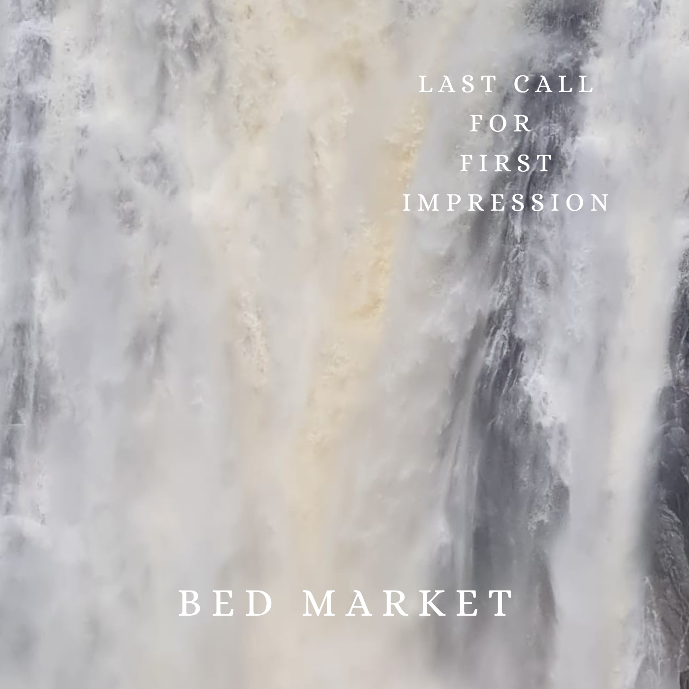
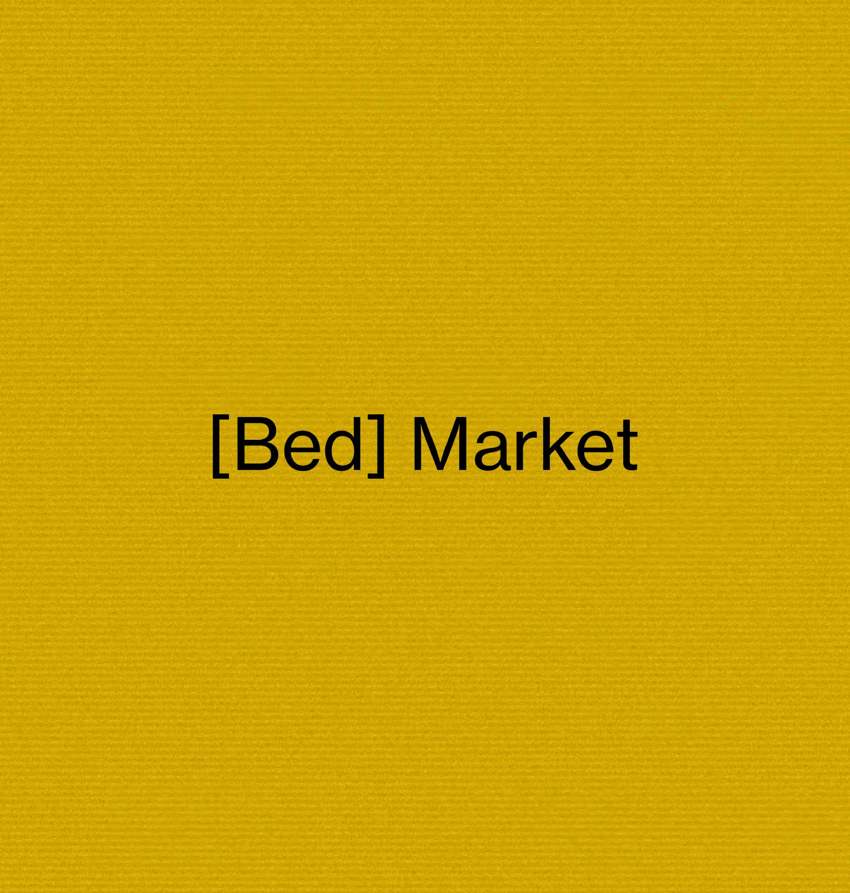

<nav aria-label="Breadcrumb" class="breadcrumb" style="margin-top: -14px;">
  <ol>
    <li><a href="/index.qmd">Home</a></li>
    <li>Bed Market</li>
  </ol>
</nav>

<small class="color-text">Album</small>
<h5 class="color-text"> Last Call for First Impression</h5>
<b class="color-text"> Bed Market</b><b> &#xB7;</b> 2025 <b>&#xB7;</b> 9 tracks, 34 min 40 s

<table style="width:100%">
<thead>
<tr>
<th style="width:10%; text-align:center;"><b>#</b></th><th><b>Title</b></th><th scope="col" style="text-align:center;"><b><i class="fa-regular fa-clock"></i></b></th>
</tr>
</thead>
<tbody>
<tr class="click-song" onclick="playSongAtIndex(0)">
  <td class="number-play" style="text-align:center;">1<i class="fa-solid fa-play play-symbol"></i><i class="fa-solid fa-pause pause-symbol"></i></td>
  <td><b class="track-title">Intro (I. I'm afraid)</b> <small class="track-artist">Bed Market</small></td>
  <td class="track-time" style="text-align:center;">0:49</td></tr>
<tr class="click-song" onclick="playSongAtIndex(1)">
  <td class="number-play" style="text-align:center;">2<i class="fa-solid fa-play play-symbol"></i><i class="fa-solid fa-pause pause-symbol"></i></td>
  <td><b class="track-title">Change</b> <small class="track-artist">Bed Market</small></td>
  <td class="track-time" style="text-align:center;">3:46</td></tr>
<tr class="click-song" onclick="playSongAtIndex(2)">
  <td class="number-play" style="text-align:center;">3<i class="fa-solid fa-play play-symbol"></i><i class="fa-solid fa-pause pause-symbol"></i></td>
  <td><b class="track-title">Isolation Cake</b> <small class="track-artist">Bed Market</small></td>
  <td class="track-time" style="text-align:center;">2:58</td></tr>
<tr class="click-song" onclick="playSongAtIndex(3)">
  <td class="number-play" style="text-align:center;">4<i class="fa-solid fa-play play-symbol"></i><i class="fa-solid fa-pause pause-symbol"></i></td>
  <td><b class="track-title">Keep Falling</b> <small class="track-artist">Bed Market</small></td>
  <td class="track-time" style="text-align:center;">2:35</td></tr>
<tr class="click-song" onclick="playSongAtIndex(4)">
  <td class="number-play" style="text-align:center;">5<i class="fa-solid fa-play play-symbol"></i><i class="fa-solid fa-pause pause-symbol"></i></td>
  <td><b class="track-title">Interlude (II. Farewell)</b> <small class="track-artist">Bed Market</small></td>
  <td class="track-time" style="text-align:center;">1:36</td></tr>
<tr class="click-song" onclick="playSongAtIndex(5)">
  <td class="number-play" style="text-align:center;">6<i class="fa-solid fa-play play-symbol"></i><i class="fa-solid fa-pause pause-symbol"></i></td>
  <td><b class="track-title">Velvet Sky</b> <small class="track-artist">Bed Market</small></td>
  <td class="track-time" style="text-align:center;">4:50</td></tr>
<tr class="click-song" onclick="playSongAtIndex(6)">
  <td class="number-play" style="text-align:center;">7<i class="fa-solid fa-play play-symbol"></i><i class="fa-solid fa-pause pause-symbol"></i></td>
  <td><b class="track-title">Sweet Memories</b> <small class="track-artist">Bed Market</small></td>
  <td class="track-time" style="text-align:center;">4:12</td></tr>
<tr class="click-song" onclick="playSongAtIndex(7)">
  <td class="number-play" style="text-align:center;">8<i class="fa-solid fa-play play-symbol"></i><i class="fa-solid fa-pause pause-symbol"></i></td>
  <td><b class="track-title">Shortcut</b> <small class="track-artist">Bed Market</small></td>
  <td class="track-time" style="text-align:center;">3:36</td></tr>
<tr class="click-song" onclick="playSongAtIndex(8)">
  <td class="number-play" style="text-align:center;">9<i class="fa-solid fa-play play-symbol"></i><i class="fa-solid fa-pause pause-symbol"></i></td>
  <td><b class="track-title">Blown Away (III. - VII.)</b> <small class="track-artist">Bed Market</small></td>
  <td class="track-time" style="text-align:center;">10:06</td>
</tr>
</tbody>
</table>

  

  
  

  
Song

  
Artist

  

  

  
  

  <i id="shuffle-song" class="fa-solid fa-shuffle fa-2x"></i>
  <i id="prev-song" class="fa-solid fa-backward-step fa-2x"></i>
  <i id="playpause-song" class="fa-solid fa-circle-play fa-3x"></i>
  <i id="next-song" class="fa-solid fa-forward-step fa-2x"></i>
  <i id="repeat-song" class="fa-solid fa-repeat fa-2x"></i>
  

  
  <input id="slider-song" type="range">

:::{#hero-heading}

**Bed Market** is an indie rock band from Lyon, France. We released our first album '**Last Call for First Impression**' in 2025 as a way of saying goodbye to all the moments we spent together making these songs.

Do not hesitate to have a listen through the **player I've coded on the right** or to check our **music videos below**. Enjoy!  

:::

 
 





