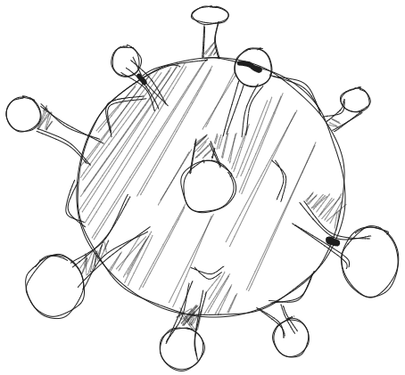
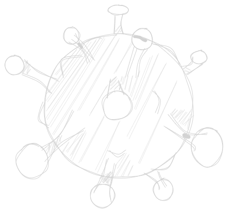

:::{.column-page}
<nav aria-label="Breadcrumb" class="breadcrumb">
  <ol>
    <li><a href="/index.qmd">Home</a></li>
    <li><a href="/Projects/Projects.qmd">Projects</a></li>
    <li>SARS-CoV-2</li>
  </ol>
</nav>

<h1 style="text-align:center;">
Deer species in France: the source of a future pandemic? 
</h1>

<h3 style="text-align: center;">
Investigating the presence of SARS-CoV-2 in french deer populations

2023
</h3>

{width="50%" .light-image}

{width="50%" .dark-image}

In 2021, while the world started slowly to exit the peak of the COVID-19 crisis, studies began to evidence that North-American white-tailed deer (*Odocoileus virginianus*) have been exposed to SARS-CoV-2, transmitted the virus to conspecifics, and even, in some cases, back to humans. This raised a worldwide interest to investigate local wild mammal populations to evaluate whether these animals could be host for the SARS-CoV-2, with a potential risk of human transmission.

During my Ph.D., and pursued during my postdoc, we evaluated the presence and seroprevalence of SARS-CoV-2 in several wild and captive populations of roe deer across France and subject to close contact with humans during scientific manipulations. We also included data on other hunted deer species.

We did not evidence SARS-CoV-2 presence in french deer species, but found support for the presence of another cross-reacting and unidentified coronavirus in these populations. You can see the details in the resulting [publication in Royal Society Open Science](https://doi.org/10.1098/rsos.251477){.text-link} and learn more about the ecological and individual factors explaining the unidentified virus dynamic among populations by consulting the [available statistical code in the CIRAD Dataverse](https://doi.org/10.18167/DVN1/AR6UDN){.text-link}.
:::