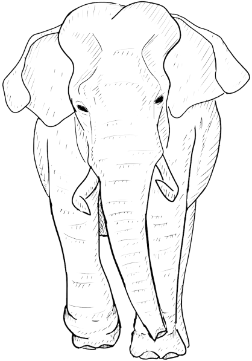
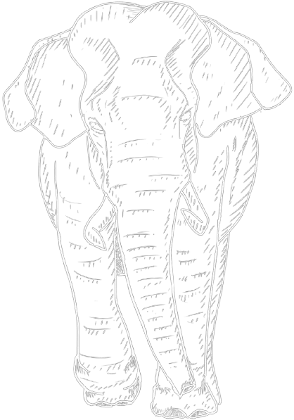
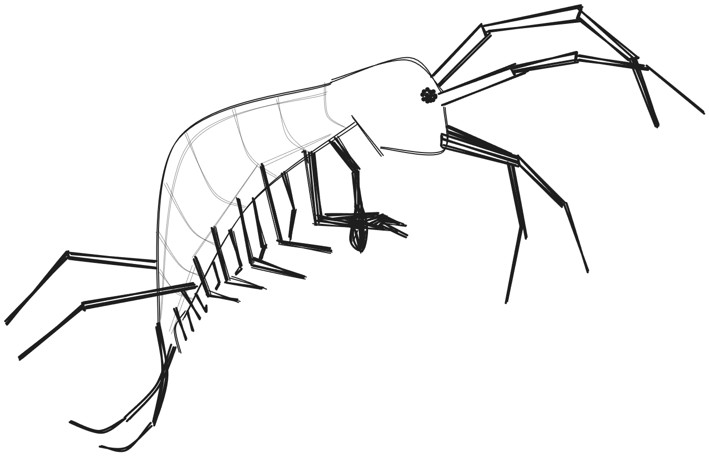

:::{.column-page}
<nav aria-label="Breadcrumb" class="breadcrumb">
  <ol>
    <li><a href="/index.qmd">Home</a></li>
    <li>Projects</li>
  </ol>
</nav>

# Research projects

Everything I have been doing this past few years!

### Stress, Health and Senescence in roe deer
:::
:::{.column-page-left}
::::: cover-container

{.cover-pic-left .light-image}
{.cover-pic-left .dark-image}

::: cover-text-stress

<big>During my Ph.D, I have explored the relationships between chronic stress, as measured by glucocorticoid metabolites, and the senescence of health- and fitness-related traits in two populations of roe deer, followed longitudinally by capture-mark-recapture programs.  </big>

[**Find out more**](../Projects/Stress.qmd){.button}

:::
:::::
:::
:::{.column-page}
### SARS-CoV-2 in deer species
:::
:::{.column-page-left}
::::: cover-container

{.cover-pic-right .light-image}
{.cover-pic-right .dark-image}

::: cover-text-covid

<big>Can wild deer species in France act as a reservoir for a future COVID-19 pandemic? It seems not, but let's learn more!  </big>

[**Check this out**](../Projects/Covid.qmd){.button}

:::
:::::
:::
:::{.column-page}
### Asian elephants ageing
:::
:::{.column-page-left}
::::: cover-container

{.cover-pic-left height="600px" .light-image}
{.cover-pic-left height="600px" .dark-image}

::: cover-text-eleph

<big>In 2020, during the pandemic, I exploited the unique database of the [Myanmar Timber Elephant Project](https://elephant-project.science/){.text-link}. I described sex-specific body mass senescence in adult Asian elephants (*Elephas maximus*). 
 I also reviewed the relationships between social environments and patterns of senescence in mammals.   </big>

[**Further details**](../Projects/Elephants.qmd){.button}

:::
:::::
:::
:::{.column-page}
### Ecology of fear in gammarids
:::
:::{.column-page-left}
::::: cover-container

{.cover-pic-right .light-image}
{.cover-pic-right .dark-image}

::: cover-text-covid

<big>Ecology of fear considers predator-induced stresses as important drivers of demographic strategies, behavioral and physiological changes. But what does it mean for gammarids?  </big>

[**More here**](../Projects/Gammarids.qmd){.button}

:::
:::::
:::