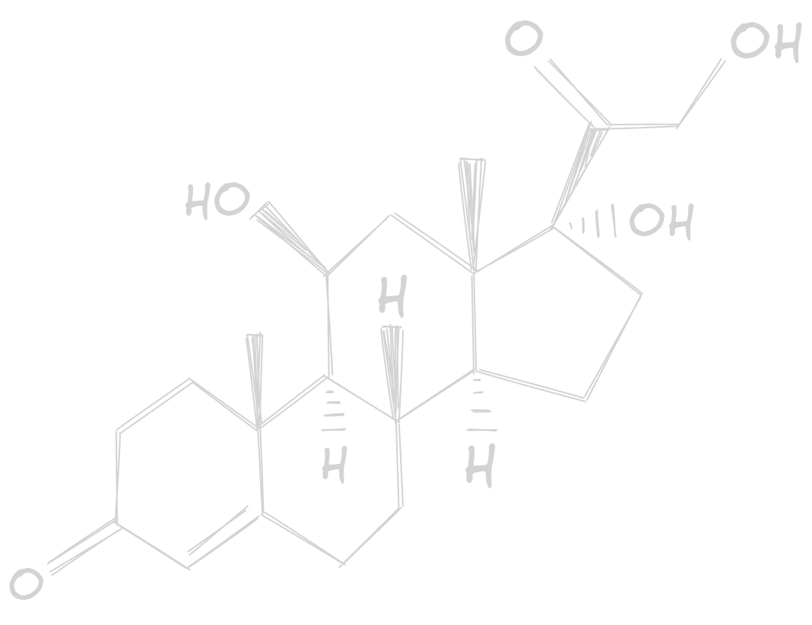

:::{.column-page}
<nav aria-label="Breadcrumb" class="breadcrumb">
  <ol>
    <li><a href="/index.qmd">Home</a></li>
    <li><a href="/Projects/Projects.qmd">Projects</a></li>
    <li>Stress, health, senescence</li>
  </ol>
</nav>

<h1 style="text-align:center;">
Stress, Health and Senescence
</h1>

<h3 style="text-align: center;">
Studying the relationships between chronic stress and health-related traits and their senescence, in wild roe deer populations

2020 - 2023
</h3>

{width="50%" .light-image}

{width="50%" .dark-image}

Throughout my Ph.D. at the Laboratory of Biometry and Evolutionary Biology (LBBE UMR5558, Université Lyon 1), I evaluated the relationships between baseline glucocorticoid (GC) levels and fitness-related traits reflecting individual health (*i.e.* body mass, physiological condition, immunity), and their senescence patterns in a long-lived mammal. 

This work was conducted in two roe deer (*Capreolus capreolus*) populations experiencing markedly contrasted environmental conditions, and which have been longitudinally followed at the individual-based
level.

We evidenced that GC levels were negatively associated to body mass in adults, but not juveniles, of both populations and both sexes, supporting the idea that it is essential to take into account the life-history stage when evaluating relationships between GCs and life-history traits. These results produced a [publication in Oikos](https://doi.org/10.1111/oik.09769){.text-link}.

In an other [study published in General and Comparative Endocrinology](https://doi.org/10.1016/j.ygcen.2024.114595){.text-link}, we found that GCs measured during early-life for individuals born during years of poor conditions were associated to higher adult abundance of lung parasites. Similarly, high GCs during early-life accelerated lymphocite count senescence, probably by affecting thymic characteristics.

We are currently terminating a work on GCs and physiological condition with promising results about how populations with different environmental conditions have developed different strategies to cope with effects of environmental stress during early-life on haematological parameters. Stay tuned to read more about this work soon!
:::

