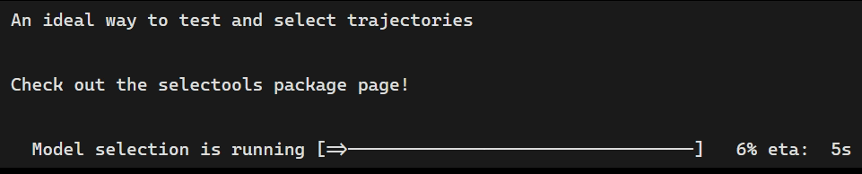

:::{.column-page}
<nav aria-label="Breadcrumb" class="breadcrumb">
  <ol>
    <li><a href="/index.qmd">Home</a></li>
    <li>Softwares</li>
  </ol>
</nav>

# Softwares

Check out the small R packages I am developing!
:::

:::::: columns
::: {.column width="2%"}
:::

::: {.column .package-card width="47%"}
#### [**conwaysGoL**](../Softwares/conwaysGoL.qmd){.card-link}

[{width="100%" height="170px" style="object-fit:cover;"}](../Softwares/conwaysGoL.qmd){.card-link}

An easy-to-handle Conway’s Game of Life simulator for R

[**View source code**](https://github.com/LucasDLalande/conwaysGoL){.button}

:::

::: {.column width="2%"}
:::

::: {.column .package-card width="47%"}
#### [**selectools**](../Softwares/selectools.qmd){.card-link}

[{width="100%" height="170px" style="object-fit: cover;"}](../Softwares/selectools.qmd){.card-link}

A facilitating model selection procedure

[**View source code**](https://github.com/LucasDLalande/selectools){.button}

:::

::: {.column width="2%"}
:::
::::::

