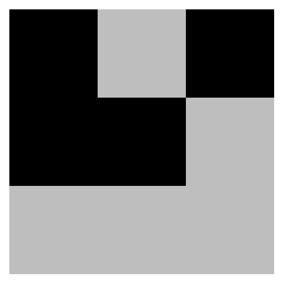
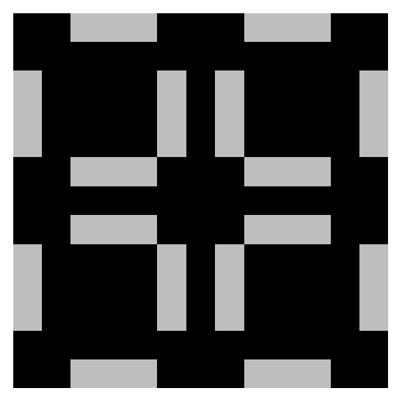
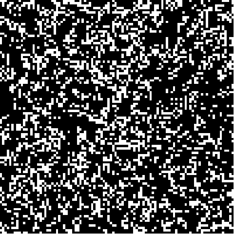
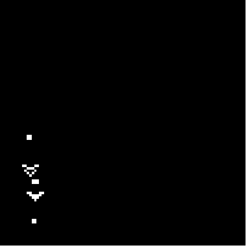

:::{.column-page}
<nav aria-label="Breadcrumb" class="breadcrumb">
  <ol>
    <li><a href="/index.qmd">Home</a></li>
    <li><a href="/Softwares/Softwares.qmd">Softwares</a></li>
    <li><span aria-current="page">conwaysGoL</span></li>
  </ol>
</nav>

<h1 style="text-align: center;">
conwaysGoL
</h1>

<h3 style="text-align: center;">
R package for Conway's Game of Life
<span style="font-weight:normal;">
<p style="color:grey; text-align:center;">
2026</p></span></h3>

The goal of `conwaysGoL` is to provide an easy-to-handle package to explore artificial life using the Conway’s Game of Life.

### Overview

The package allows to run simulations in a toroidal grid of any size for a desired number of generations. Users can save their simulations as a succession of frames and/or as GIFs. The package comes with a library of some common patterns that can be used freely during their simulations. This library can be enriched by the users and stored patterns can be used indefinitely across R sessions. Finally, users can easily convert Run-Length Encoding (RLE) files (from [https://copy.sh/life/](https://copy.sh/life/){.text-link} for example) into binary (0,1) matrices compatible with the package functions.<br><br>

<h5 style="text-align:center;">
[**Install from GitHub**](github.com/LucasDLalande/conwaysGoL){.button}
</h5>
<br>
<br>

:::::::::: columns
::::: {.column .package-card width="49%"}
:::: tooltip-container
{width="100%" height="100%" style="object-fit: cover;"} <small> *A glider (in white)* </small>

::: tooltip-content
<p>A glider is a pattern that travels across the grid.</p>

``` r
# from a manual matrix
glider <- matrix(c(0,1,0,
0,0,1,
1,1,1),
nrow = 3,
byrow = TRUE)

plot_grid(glider)

# from the built-in pattern list
plot_grid("glider")
```
:::
::::
:::::

::: {.column width="2%"}
:::

::::: {.column .package-card width="49%"}
:::: tooltip-container
{width="100%" height="100%" style="object-fit: cover;"} <small> *A pulsar (in white)* </small>

::: tooltip-content
<p>A pulsar is a common oscillator with a period of 3.</p>

``` r
# from a manual matrix
pulsar <- matrix(
c(0,0,1,1,1,0,0,0,1,1,1,0,0,
  0,0,0,0,0,0,0,0,0,0,0,0,0,
  1,0,0,0,0,1,0,1,0,0,0,0,1,
  1,0,0,0,0,1,0,1,0,0,0,0,1,
  1,0,0,0,0,1,0,1,0,0,0,0,1,
  0,0,1,1,1,0,0,0,1,1,1,0,0,
  0,0,0,0,0,0,0,0,0,0,0,0,0,
  0,0,1,1,1,0,0,0,1,1,1,0,0,
  1,0,0,0,0,1,0,1,0,0,0,0,1,
  1,0,0,0,0,1,0,1,0,0,0,0,1,
  1,0,0,0,0,1,0,1,0,0,0,0,1,
  0,0,0,0,0,0,0,0,0,0,0,0,0,
  0,0,1,1,1,0,0,0,1,1,1,0,0),
nrow = 13,
byrow = TRUE
)

plot_grid(pulsar)

# from the built-in pattern list
plot_grid("pulsar")
```
:::
::::
:::::
::::::::::

:::: columns
::: {.column width="100%"}
:::
::::

:::::::::: columns
::::: {.column .package-card width="49%"}
:::: tooltip-container
{width="100%" height="100%" style="object-fit: cover;"} <small> *An example of a Conway's Game of Life.* </small>

::: tooltip-content
<p>A randomly generated 100x100 grid following Conway's Game of Life rules for 100 generations. Notice the presence of still-lifes, oscillators and random patterns.</p>

``` r
gameoflife(nrow = 100,
ncol = 100,
generations = 100,
p = 0.8,
record = TRUE,
frames_prefix = "random",
zero_padding = 3,
gif_name = "random.gif",
output_path = "animations/")
```
:::
::::
:::::

::: {.column width="2%"}
:::

::::: {.column .package-card width="49%"}
:::: tooltip-container
{width="100%" height="100%" style="object-fit: cover;"} <small> *A Gosper glider gun for 1000 generations.* </small>

::: tooltip-content
<p>A single Gosper glider gun for 1000 generations. Guns are patterns displaying infinite growth by generating smaller patterns, here gliders. Gosper glider guns have a period of 30. As time advances, we can observe new structures appearing as gliders hit back the gun, some of those being still-life structures, some others being oscillators or random structures.</p>

``` r
gameoflife(nrow = 100,
ncol = 100,
generations = 1000,
pattern = "gosper_gun",
pos.row = 10,
pos.col = 10,
rotation = 90,
record = TRUE,
frames_prefix = "gosper_glider",
zero_padding = 3,
gif_name = "gosper_glider.gif",
output_path = "animations/")
```
:::
::::
:::::
::::::::::

### Functions

<li>
<div class="tooltip-containershort">
<p><code>gameoflife()</code></p>
<div class="tooltip-content">
<p>Runs a simulation starting with a glider (initial position: (10,10)) and a Gosper glider gun (initial position: (60, 60)), rotated clockwise, in an empty grid.
By setting `record = TRUE`, users can save their simulation as GIF file in desired directory.</p>
```r
gameoflife(
  nrow = 100,
  ncol = 100,
  generations = 50,
  pattern = c("glider", "gosper_gun"),
  pos.row = c(10, 60),
  pos.col = c(10, 60),
  rotation = 90,
  record = TRUE,
  frames_prefix = "gosper_glider",
  zero_padding = 3,
  gif_name = "gosper_glider.gif",
  output_path = "animations/"
)
```
</div>
</div><span> to run (and record) simulations.</span>
</li>

<br>
<li>
<div class="tooltip-containershort">
<p><code>plot_grid()</code></p>
<div class="tooltip-content">
<p> Enter either a manually constructed matrix, or a built-in pattern in `plot`.</p>

```r
# direct matrix
glider <- matrix(
  c(0,1,0,
    0,0,1,
    1,1,1),
  nrow = 3,
  byrow = TRUE
)

plot_grid(glider)

# multiple patterns
plot_grid(list("pulsar", glider))
```

</div>
</div><span> to visualize binary (0,1) matrices and built-in patterns.</span>
</li>

<br>
<li>
<div class="tooltip-containershort">
<p><code>list_patterns()</code></p>
<div class="tooltip-content">
<p>Buit-in patterns can be accessed via `list_patterns()`.</p>

```r
list_patterns()
#>  [1] "beacon"         "beehive"        "blinker"        "block"         
#>  [5] "boat"           "glider"         "gosper_gun"     "HWSS"          
#>  [9] "loaf"           "LWSS"           "MWSS"           "pentadecathlon"
#> [13] "pulsar"         "random"         "toad"           "tub"
```

</div>
</div><span> to access the list of built-in patterns.</span>
</li>

<br>
<li>
<div class="tooltip-containershort">
<p><code>add_pattern()</code></p>
<div class="tooltip-content">
<p>Adds temporarily or permanently patterns to the pattern library (`permanent = FALSE` (default) or `permanent = TRUE`).</p>

```r
# temporary add a pattern built by the user
pattern <- matrix(
  c(1,0,0,
    1,1,1,
    0,0,1),
  nrow = 3,
  byrow = TRUE
)

add_pattern("my_own_pattern", pattern)

# permanently add a pattern
add_pattern("my_own_permanent_pattern", pattern, permanent = TRUE)

# can be plotted and used in gameoflife
```

</div>
</div><span> to permanently or temporarily add patterns to the built-in list of patterns.</span>
</li>

<br>
<li>
<div class="tooltip-containershort">
<p><code>read_rle()</code></p>
<div class="tooltip-content">
<p>Automatically convert RLE files into pattern matrix by providing `rle_path` as the relative or absolute path the downloaded file.</p>

```r
# a pattern extracted from a .rle file
cordership <- read_rle("patterns/cordership.rle")

# can be plotted or used in gameoflife()

# can be added to the library temporarily or permanently
add_pattern("cordership", cordership, permanent = TRUE)
```

</div>
</div><span> to convert Run-Length Encoding (RLE) files from a downloaded .rle file.</span>
</li>

### Resources

All documentation and source code for the `conwaysGoL` package can be found on my [GitHub page](github.com/LucasDLalande/conwaysGoL){.text-link}.

### License

This package is under the MIT License.

### Citation

To cite `conwaysGoL` in your publications, please use:

*conwaysGoL v0.1.1*

> Lalande LD (2026). conwaysGoL: An easy-to-handle Conway’s Game of Life simulator for R. R package version 0.1.0. [10.5281/zenodo.18290213](https://doi.org/10.5281/zenodo.18290213){.text-link}.

*For the canonical citation of the software project, use the concept DOI:*

> [10.5281/zenodo.18290212](https://doi.org/10.5281/zenodo.18290212){.text-link}

:::
