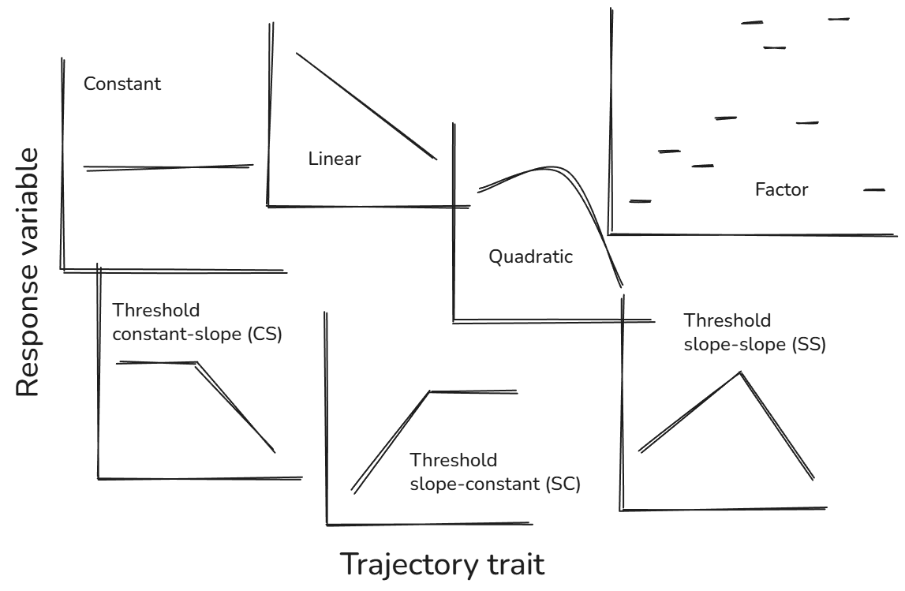
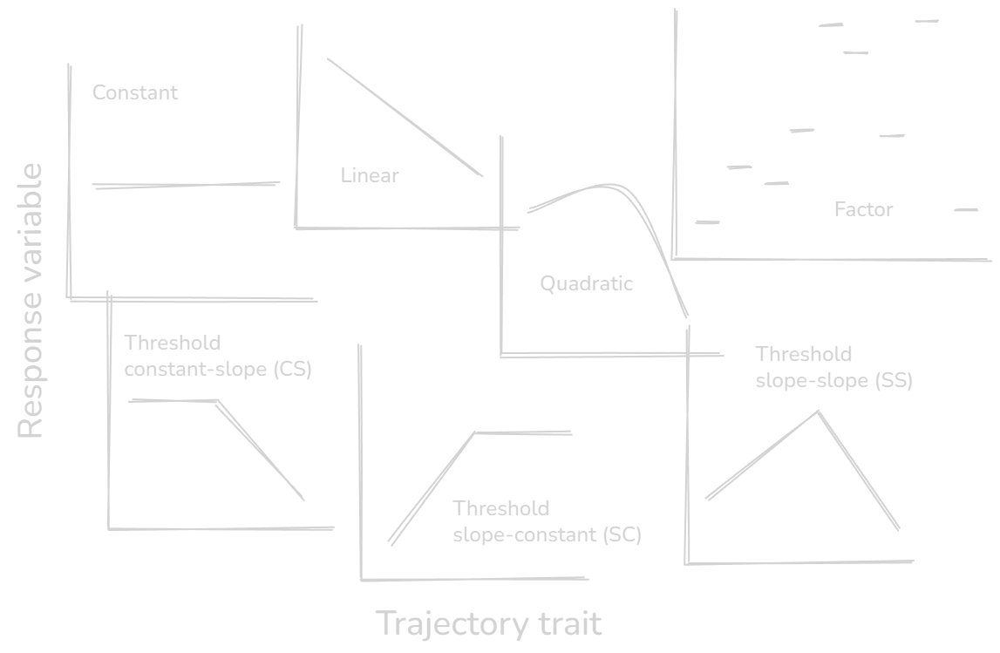

:::{.column-page}
<nav aria-label="Breadcrumb" class="breadcrumb">
  <ol>
    <li><a href="/index.qmd">Home</a></li>
    <li><a href="/Softwares/Softwares.qmd">Softwares</a></li>
    <li><span aria-current="page">selectools</span></li>
  </ol>
</nav>

<h1 style="text-align: center;">
selectools
</h1>

<h3 style="text-align: center;">
R package for trajectory model selection
<span style="font-weight:normal">
<p style="color:grey; text-align:center;">
2026</p></span></h3>
{fig-align="center" width="100%"}
:::

:::{.column-page}
The goal of `selectools` is to provide and facilitate model selection procedures, mostly based on AIC and AICc, and adapting the `MuMIn::dredge()` function.

### Overview

`selectools` can be viewed as a two-part package, with on one hand a full pipeline for trajectory analyses, and on the other hand an adaptation of `MuMIn::dredge()` for phylogenetic model. More specifically, the package contains:

- a set of function to perform trajectory analyses. It is designed for model selection from A to Z when testing different trajectories as can be done in senescence research, by automatically computing, fitting, testing, comparing and ranking constant, linear, quadratic, factor and threshold trajectories.

- a function to perform model selection of phylogenetic generalized linear mixed models (`phyr::pglmm()`). It generates a model selection table of models as would do `MuMIn::dredge()` with combinations (subsets) of fixed effect terms in the global model, with optional model inclusion rules.
<br>
<br>

<h5 style="text-align:center;">
[**Install from GitHub**](https://github.com/LucasDLalande/selectools){.button}
</h5>
<br>

### Functions

#### Trajectory model selection pipeline

<li>
<div class="tooltip-containershort">
<p><code>trajectory_formulas()</code></p>
<div class="tooltip-content">
<p>Define your formula structure (`formula`), excluding the trait for which different trajectories should be tested (`trajectory_trait`). Define terms interacting with trajectory_trait (`interactions`). Provide the `data.frame` containing all variables described in `formula`, `trajectory_trait` and `interactions`. Finally, define which trajectories should be built (`trajectories`, defaults to `"all"` but choose among `"constant"`, `"linear"`, `"quadratic"`, `"factor"` - or `"non-threshold"` for all four non-threshold trajectories -, `"thresholdCS"`, `"thresholdSC"`, `"thresholdSS"` - or `"threshold"` for all three threshold trajectories).
It returns an object of class `trajectory.formulas` containing all trajectory formulas selected.</p>

```r
trajectory_formulas(
  formula, 
  trajectory_trait, 
  interactions = NULL, 
  data, 
  trajectories = "all"
)

# Print S3 method
print(x, ...)
```

</div>
</div><span> to automatically build formulas for all desired trajectories among constant, linear, quadratic, factor and threshold trajectories (see below and note that slopes or curvatures can be of any sign).</span>
</li>

:::{.column-page}
{fig-align="center" .light-image}
{fig-align="center" .dark-image}
:::

<br>
<li>
<div class="tooltip-containershort">
<p><code>estimate_threshold()</code></p>
<div class="tooltip-content">
<p>`threshold_formulas` takes either the `trajectory.formulas` object generated by `trajectory_formulas()` or a named list of threshold `formula` object. `start`, `end`, `iter` specifies where to start, end and how to increment threshold point tests. `lmer_control` should ideally stay `NULL` (default). If no random effects, then `lmer_control` is `NULL`, otherwise it refers to the internal object `lmerControl_default` which uses Bound Optimization BY Quadratic Approximation, "bobyqa" and 1e5 as maximal number of evaluation. Advanced users can supply custom optimizer controls for `lmerMod` class objects.
Returns a `threshold.estimation` object containing a list of the best threshold point for each threshold trajectory.
The plot `S3` method allow to consult plots of AIC/AICc values according to threshold values for each trajectory.</p>

``` r
estimate_threshold(
  data,
  threshold_formulas,
  trajectory_trait,
  start,
  end,
  iter,
  rank = c("AICc", "AIC"),
  lmer_control = NULL
)

# Print S3 method
print(x, ...)
    
# Plot S3 method
plot(x, model = c("thresholdCS", "thresholdSC", "thresholdSS"))
```

</div>
</div><span> to estimate the best threshold point according to AIC or AICc value (`rank`).</span>
</li>

<br>
<li>
<div class="tooltip-containershort">
<p><code>fit_model()</code></p>
<div class="tooltip-content">
<p>`formulas` takes either the `trajectory.formulas` object generated by `trajectory_formulas()` or a named list of `formula` object to be tested. If `formulas` includes threshold formulas, `best_thresholds` takes either a `threshold.estimation` object obtained with `estimate_threshold()` or a named list of numeric values specifying threshold points.
Returns a `models` object containing all trajectory model fits and an attached environment with threshold datasets (i.e. copies of data with `trajectory_trait` recalculated according to threshold points).</p>

``` r
fit_models(
  formulas, 
  trajectory_trait, 
  data, 
  best_thresholds = NULL, 
  lmer_control = NULL
)

# Print S3 method
print(x, ...)
```

</div>
</div><span> to fit `lme4::lmer()` or `stats::lm()` models for all trajectories, accounting for threshold estimations obtained by `estimate_threshold()`.</span>
</li>

<br>
<li>
<div class="tooltip-containershort">
<p><code>dredge_trajectories()</code></p>
<div class="tooltip-content">
<p>`models` is an object generated by `fit_models()`, exclusively. `delta_criterion` is a numeric value that is used to select the subset of best models. The best model is selected as the model with the lowest number of parameters (df) among models below delta_criterion (either delta_AICc or delta_AIC). Delta is the difference between the criterion (AIC or AICc) value of a given model, and the criterion of the model with the lowest criterion value.
Returns a `dredge.results` object containing `model.selection` tables (either complete, subset below `delta_criterion` or best model).</p>

``` r
dredge_trajectories(
  models, 
  trajectory_trait, 
  rank = c("AIC", "AICc"), 
  delta_criterion = 2, 
  data
)
```

</div>
</div><span> to apply the `MuMIn::dredge()` function to each model trajectory. For each trajectory (constant, linear, quadratic, factor, thresholds), the function selects the best model based on criterion (`rank = "AIC"` or `rank = "AICc"`) value.</span>
</li>

<br>
<li>
<div class="tooltip-containershort">
<p><code>best_trajectory()</code></p>
<div class="tooltip-content">
<p>`dredge_results` is a `dredge.results` object obtained with `dredge_trajectories()`, exclusively. `adjust_threshold` is a logical argument stating whether 1 number of parameters and 2 AICc/AIC values should be added for threshold models to account for the implicit cost of the threshold parameter (defaults to `TRUE`).
Returns a `best.trajectory` object containing recap and summary information of selected trajectory.</p>

``` r
best_trajectory(
  dredge_results, 
  delta_criterion = 2, 
  adjust_threshold = TRUE
)
  
# Print S3 method
## prints a recap of the best trajectory (type = "global") or the best model of 
## each trajectory (type = "by_trajectory")
print(x, type = c("global", "by_trajectory"))

# Summary S3 method
## prints a summary of the best model trajectory (type = "global") or the best model of 
## each trajectory (type = "by_trajectory")
summary(x, type = c("global", "by_trajectory"))
```

</div>
</div><span> to select the final retained trajectory by comparing the retained models for each trajectory according to their number of parameters and AIC or AICc values.</span>
</li>

<br>
<li>
<div class="tooltip-containershort">
<p><code>select_trajectory()</code></p>
<div class="tooltip-content">
<p>All arguments have been described above.
Returns a `best.trajectory` object containing recap and summary information of selected trajectory.</p>

``` r
select_trajectory(
  formula,
  trajectory_trait,
  interactions = NULL,
  data,
  trajectories = "all",
  start, end, iter,
  rank = c("AICc", "AIC"),
  delta_criterion = 2,
  adjust_threshold = TRUE,
  lmer_control = NULL
)

# Print S3 method
## prints a recap of the best trajectory (type = "global") or the best model of 
## each trajectory (type = "by_trajectory")
print(x, type = c("global", "by_trajectory"))

# Summary S3 method
## prints a summary of the best model trajectory (type = "global") or the best model of 
## each trajectory (type = "by_trajectory")
summary(x, type = c("global", "by_trajectory"))
```

</div>
</div><span> is a wrapper allowing to run in one command the whole pipeline of functions described above.</span>
</li>

#### Phylogenetic model selection

<li>
<div class="tooltip-containershort">
<p><code>dredge_pglmm()</code></p>
<div class="tooltip-content">
<p>Define your random effects (`formulaRE`), fixed effects (`fixed`), `data`, model selection criterion (`rank`: AIC or AICc), distribution `family` (gaussian , binomial or poisson), the covariance matrix of the random effects (`cov_ranef`, *i.e.* usually an object of class phylo) and whether to display estimates and/or standard-errors.</p>

``` r
dredge_pglmm(
  formulaRE,
  fixed,
  data,
  rank = c("AICc", "AIC"),
  family = c("gaussian", "binomial", "poisson"),
  cov_ranef,
  estimate = T,
  std.err = F,
  round = 3
)
```

</div>
</div><span> to define and fit a pglmm model and perform model selection based on AIC or AICc.</span>
</li>

### Resources

All documentation and source code for the `selectools` package can be found on my [GitHub page](github.com/LucasDLalande/selectools){.text-link}.

### License

This package is under the MIT License.

### Citation

To cite the `selectools` package in your publications, please use:

*selectools v0.3.0*

> Lalande LD (2026). selectools: A facilitating model selection procedure. R package version 0.2.1. [10.5281/zenodo.20378446](https://doi.org/10.5281/zenodo.20378446){.text-link}.

*For the canonical citation of the software project, use the concept DOI:*

> [10.5281/zenodo.18289845](https://doi.org/10.5281/zenodo.18289845){.text-link}

This package has been cited in:

> Cambreling S, Ronget V, Remot F, Gaillard J-M, Lemaître J-F. (2025). Male reproductive senescence in mammals is pervasive and aligned with the slow-fast continuum. Ecology Letters. 28, e70194. [10.1111/ele.70194](https://doi.org/10.1111/ele.70194){.text-link}

:::